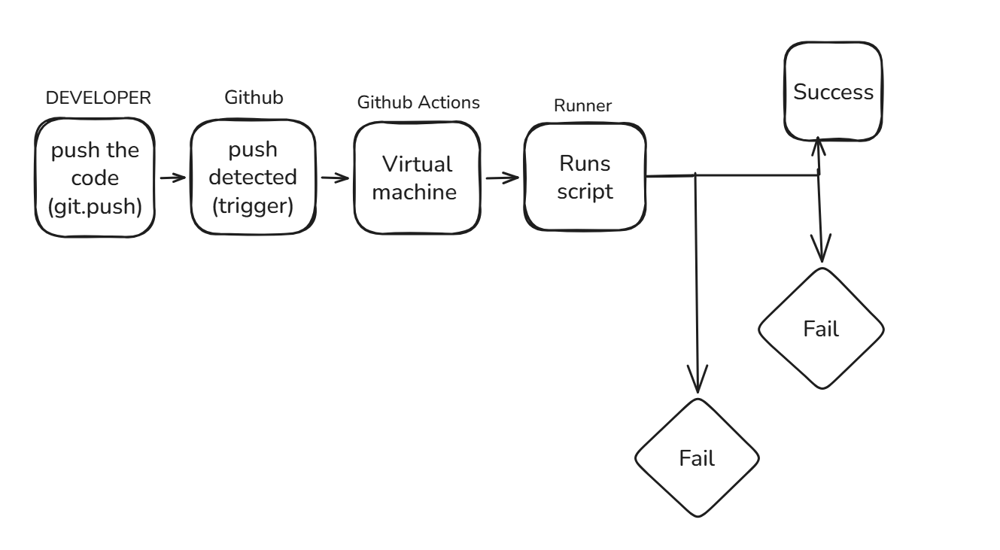

# devops-task

## numberpattern.py explanation
 The file numberpattern.py has a small code that gives:
   ->A pattern of numbers in a triangular shape 
   ->it has 7 rows as the input
   -> the output looks like the following:
      1
     121
    12321
   1234321
  123454321
 12345654321
1234567654321

## Git commands:
i) Clone: 
   - I created a repository on my github account and cloned that repository to my local computer using the git command on my terminal - "git clone https://github.com/namuu01/devops-task.git

ii) Branching 
   - I created a new branch "feature" using the git command on my terminal - "git checkout -b feature"

iii) Commit 
    - This is basically stagging and commiting (saving) changes. 
    - Once evrything is done we can commit the changes to the local system - "git commit -m "Added README.md"

iv) Push 
    - We use this to to push the file to the github by - "git push origin feature"

## GitHub Actions Workflow
The repository uses GitHub Actions to run a simple CI pipeline.  
The workflow is defined in `.github/workflows` and triggered automatically on every git push command

### What the workflow does
- Checks out the code - from the repository.
- Runs a one-line script - to confirm the pipeline is working:
  echo "Hello, the CI pipeline is running successfully!"
- This flowchart helps us understand the workflow better:

- The flowchart explains:
**Developer** → Pushes code (git push)
we commit and push changes to GitHub.

**GitHub** → Detects push (Trigger)
GitHub sees the new push and triggers the workflow defined in main.yml.

**GitHub Actions** → Starts a Runner (VM)
GitHub spins up a virtual machine (runner) to execute the jobs.

**Runner** → Runs the Script (echo Hello)
The runner executes the steps in the YAML file (in this case, just printing a message).

**Status** → Success or Fail 
If the script runs correctly, a green check is shown.

